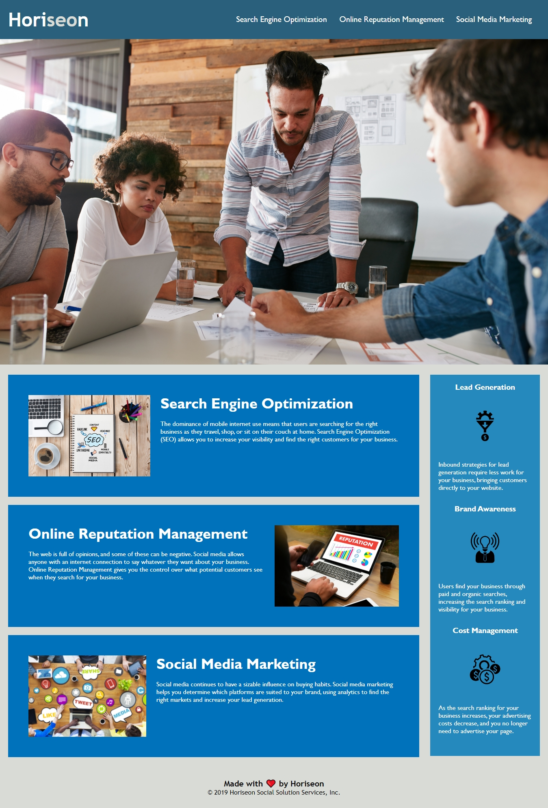

# Horiseon Code Refactor

## Description 

The existing Horiseon landing page needed to be refactored for accessibility.  The goals included to modify the existing HTML and CSS so that a user with visual impairment can successfully interact with the page using assistive technology and to achieve search engine optimization.  The visual layout and user experience was not to be modified from the existing HTML and CSS code provided by the client.  Any best practices that were not being observed were also to be remedied.  

## Table of Contents

* [Installation](#installation)
* [Usage](#usage)
* [Credits](#credits)
* [License](#license)
* [Badges](#badges)

## Installation

The following steps were used to accomplish this project.

- Changed generic `
` elements to appropriate semantic elements such as `<header>`, `<section>` and `<aside>`.
- Added spacing to the HTML between major subsections of the page.
- Commented the HTML sections and CSS class definitions.  
- Provided `<alt="description">` to all `` elements.  
- Provided website title.  
- Resolved issue where there was no `<id="search-engine-optimization">` for the navigation element `<a href="#search-engine-optimization">`

## Usage 

## Credits

Matt Noreika was the sole contributor on this project.  

The `alt` attribute was added to the hero image using information from [this thread](https://stackoverflow.com/questions/4216035/css-background-image-alt-attribute/17126523) at Stack Overflow.  This was necessary because the existing image definition was in the CSS file, and was initially referenced by the code `
`.  In the final version it is changed to the semantic type `<figure>`.  To add an `alt` attribute, this code was used: `role="img" aria-label="Group of employees around conference table"`.  

## License

[MIT license](./LICENSE)

